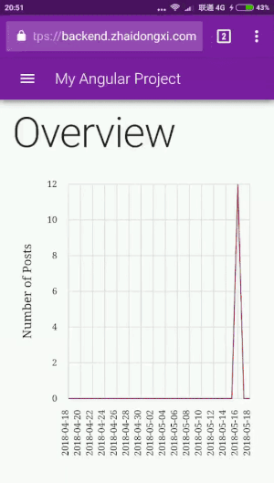

# angular-app-example

<p align="center">
  <a href="https://demo.zhaidongxi.com/angular-app-example/" target="_blank">
    
  </a>
</p>

这是一个[Angular](https://github.com/angular/angular)应用的例子

[Demo](https://demo.zhaidongxi.com/angular-app-example/) 账户信息：

- Username: `demo`
- Password: `demo`

**注意：请不要修改密码，你可以为自己创建一个账户**

本应用包含以下特点:

- Google [材料](https://github.com/angular/material2) 设计
- Sass 主题
- 使用漂亮的 RESTful API
- 拒绝 Cookies
- 用户登录
- [图表](https://github.com/swimlane/ngx-charts) 和 [数据表格](https://github.com/swimlane/ngx-datatable)
- 创建/更新/删除 数据
- 搜索/排序 数据
- 文件（用户头像）上传
- HTTP 拦截器

## Quick Start

```
git clone https://github.com/daixianceng/angular-app-example.git
cd angular-app-example

# 必要的话，安装 Angular CLI
npm install -g @angular/cli@latest

# 如果在 Windows 下出错，请运行以下命令
npm install -g windows-build-tools

# 安装依赖
npm install
# 在开发环境下启动应用
npm start
```

现在你可以在浏览器中打开`localhost:4200`开始体验。项目依赖于[yii2-app-example](https://github.com/daixianceng/yii2-app-example)的API，这是一个干净、漂亮的RESTful API，你一定会爱上它。项目有一个默认指向`https://demo.zhaidongxi.com/yii2-app-example-backend-api`的代理，所以你不需要安装`yii2-app-example`。

编译项目:

```
npm run build
```

## Directory Layout

在开始之前，你应该了解一下项目目录的结构:

```
.
├── /dist/                           # 编译生成的目录
├── /e2e/                            # 端到端测试
├── /node_modules/                   # 第三方依赖
├── /src/                            # 应用源码
│   ├── /app/                        # 核心源码
│   │   ├── /common/                 # 公共工具
│   │   ├── /components/             # Angular 组件
│   │   ├── /containers/             # 页面模块
│   │   ├── /layouts/                # 页面布局
│   │   ├── /models/                 # 数据模型
│   │   ├── /services/               # Angular 服务
│   │   ├── /stores/                 # 应用数据仓库
│   │   ├── /app-routing.module.ts   # 路由模块
│   │   ├── /app.component.html      # 根组件的模板
│   │   ├── /app.component.scss      # 根组件的样式
│   │   ├── /app.component.spec.ts   # 根组件的单元测试
│   │   ├── /app.component.ts        # 根组件
│   │   └── /app.modules.ts          # 根模块
│   ├── /assets/                     # 静态文件，编译时会被复制到 /dist 目录
│   ├── /environments/               # 包含环境配置文件
│   │   ├── /environment.prod.ts     # 生产环境配置文件
│   │   └── /environment.ts          # 开发环境配置文件
│   ├── /themes/                     # 应用的主题
│   ├── /app-theme.scss              # 定义当前应用的主题
│   ├── /favicon.ico                 # Angular icon
│   ├── /index.html                  # HTML 页面
│   ├── /main.ts                     # 应用的入口文件
│   ├── /polyfills.ts                # 包含 polyfills 的文件
│   ├── /styles.scss                 # 应用的全局样式
│   ├── /test.ts                     # 应用的单元测试入口
│   ├── /tsconfig.app.json           # TypeScript 编译器的配置
│   ├── /tsconfig.spec.json          # TypeScript 编译器的单元测试的配置
│   └── /typings.d.ts                # TypeScript Typings
├── .editorconfig                    # 编辑器的配置
├── .gitignore                       # Git 忽略文件
├── .jsbeautifyrc                    # Beautify 插件的配置
├── angular.json                     # Angular CLI 的配置
├── karma.conf.js                    # Karma 的配置
├── LICENSE                          # 项目许可证文件
├── media.gif                        # 项目demo动画图像
├── package.json                     # 第三方依赖
├── protractor.conf.js               # Protractor 的端到端测试配置
├── proxy.json                       # 开发环境下的代理配置
├── README.md                        # 文档
├── README.zh_CN.md                  # 中文文档
├── sass-lint.yml                    # Sass Lint 的配置
├── tsconfig.json                    # TypeScript 编译器的配置
└── tslint.json                      # TSLint 和 Codelyzer 的配置
```

## License

**angular-app-example** 使用 BSD 3-Clause 许可证发布。 详情请进入 `LICENSE` 查看。
